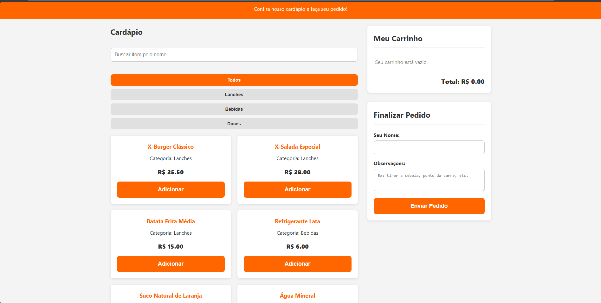
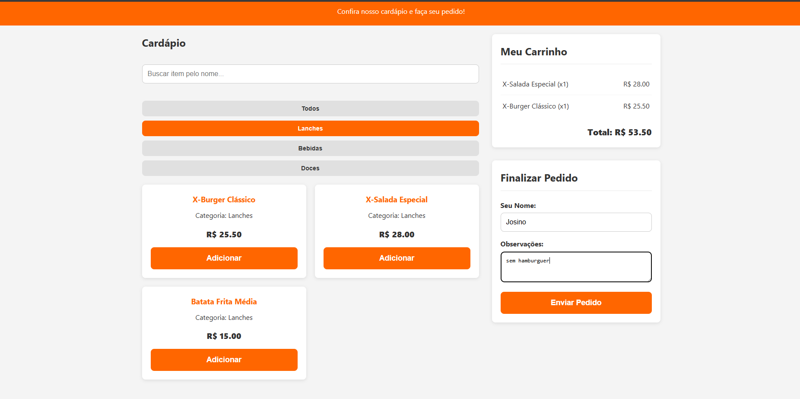
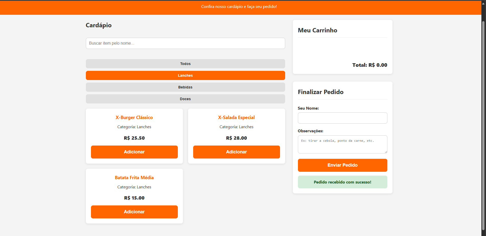

# Cardápio de Lanchonete Online

Projeto desenvolvido como parte da avaliação técnica para a vaga de Estágio em Desenvolvimento de Software. A aplicação consiste em um cardápio digital para uma lanchonete, permitindo aos clientes visualizar os produtos, adicioná-los a um carrinho e enviar um pedido.

---

## ✨ Funcionalidades

- **Visualização do Cardápio:** Os itens são carregados a partir de um backend e exibidos na interface.
- **Busca por Nome:** O usuário pode buscar por itens do cardápio em tempo real.
- **Filtro por Categoria:** Botões dinâmicos permitem filtrar os itens por categoria (Lanches, Bebidas, Doces).
- **Carrinho de Compras:** Funcionalidade para adicionar itens, visualizar o subtotal e o total geral do pedido.
- **Envio de Pedido:** Um formulário permite que o cliente insira seu nome e observações, enviando o pedido completo para o backend.
- **Armazenamento de Pedidos:** O backend recebe os pedidos e os salva em um arquivo `pedidos.json`.

---

## 🛠️ Tecnologias Utilizadas

- **Frontend:**
  - HTML5 (Semântico)
  - CSS3 (Responsivo com Flexbox e Grid)
  - JavaScript (ES6+)

- **Backend:**
  - Node.js
  - Express.js

- **Armazenamento:**
  - Arquivos JSON

- **Ferramentas e Ambiente:**
  - Visual Studio Code
  - Git & GitHub
  - **Git Bash:** O terminal recomendado para a execução de todos os comandos de instalação e inicialização.

---

## 🚀 Como Executar a Aplicação

Siga os passos abaixo para instalar as dependências e rodar o projeto localmente.

### **Pré-requisitos**

Antes de começar, você vai precisar ter as seguintes ferramentas instaladas:
- [Node.js](https://nodejs.org/en/) (que inclui o npm)
- [Git](https://git-scm.com/)

### **Passo a Passo**

1.  **Clone o repositório:**
    ```bash
    git clone [https://github.com/Psychovv/avaliacao-estagio-cardapio.git](https://github.com/Psychovv/avaliacao-estagio-cardapio.git)
    cd avaliacao-estagio-cardapio
    ```

2.  **Instale as dependências do Backend:**
    Navegue até a pasta do backend e utilize o npm para instalar os pacotes necessários.
    ```bash
    cd problema1_cardapio/backend
    npm install
    ```

3.  **Inicie a Aplicação (Backend e Frontend):**
    Para a aplicação funcionar, o servidor backend e o cliente frontend precisam rodar simultaneamente. Para isso, você precisará de **dois terminais Git Bash abertos**.

    **Terminal 1 - Iniciando o Backend:**
    ```bash
    # (Já dentro da pasta /backend)
    npm start
    ```
    > O servidor começará a rodar na porta `http://localhost:3000`. Deixe este terminal aberto.

    **Terminal 2 - Iniciando o Frontend:**
    ```bash
    # Abra um novo terminal Git Bash
    # Navegue até a pasta do frontend a partir da raiz do projeto
    cd problema1_cardapio/frontend

    # Execute o frontend com o live-server
    # (O npx executa o pacote sem a necessidade de instalação global)
    npx live-server
    ```
    > O `live-server` iniciará automaticamente o `index.html` no seu navegador. A aplicação estará pronta para uso.

---

## 📸 Capturas de Tela

**1. Tela de Listagem do Cardápio**
*Interface principal exibindo os produtos e os filtros por categoria.*


**2. Processo de Pedido**
*Usuário com itens adicionados ao carrinho e preenchendo o formulário para finalizar a compra.*


**3. Confirmação do Pedido**
*Mensagem de sucesso exibida ao usuário após o envio bem-sucedido do pedido.*
